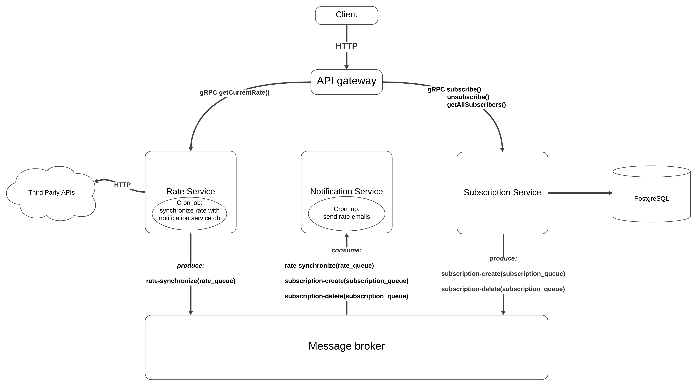

## Description

API service that allows you to get current rate USD to UAH. It uses NBU API to get exchange rate.

## Application architecture


## Preparation for running the app
Add environment variables for microservices according to samples

## Running the app in Docker

```bash
# build image and up containers in background
$ docker compose up -d --build
```
